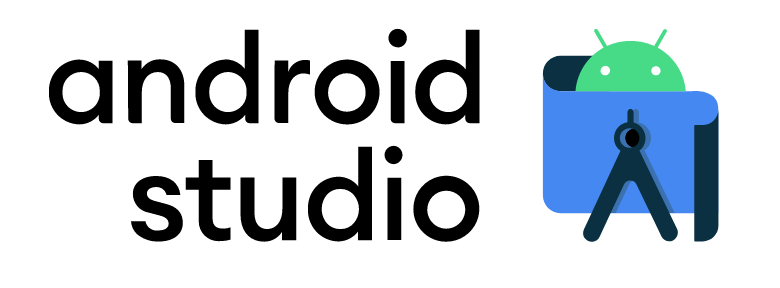

# NativeScript-Vue

# Introducción

---

<!-- _class: lead -->

# ¿Qué es NativeScript?

---

<!-- _class: lead -->


-   Framework Open Source
-   Construcción de aplicaciones nativas para Android / iOS
-   Tecnologías Web

---

<!-- _class: lead -->

# Flavours

---

<!-- _class: lead -->


---

<!-- _class: lead -->


-   NS + JavaScript
-   NS + TypeScript
-   NS + Angular
-   NS + Vue
-   NS + React
-   NS + Svelte
-   NS + Capacitor
-   NS + Ionic

---


# NativeScript-Vue

---

<!-- _class: lead -->


-   Plugin de NativeScript
-   Construcción de apps nativas para mobile utilizando Vue.js
-   Interfaces hechas con componentes que compilan a nativo
-   Podemos estilar con css los componentes

---

<!-- _class: lead -->

# Apps nativas: Beneficios

---

<!-- _class: lead -->


-   Mejor rendimiento
-   Aceleración gráfica optimizada
-   Acceso a APIS restringidas al navegador
-   iOS [(UIDevice)](https://developer.apple.com/documentation/uikit/uidevice)
-   Android [(getSystemService)](https://developer.android.com/reference/android/content/Context#getSystemService)

---

<!-- _class: lead -->

# Apps nativas: Perjuicios

---

<!-- _class: lead -->




-   Equipos de desarrollo específicos por plataforma
-   Aumento en coste del producto (tiempo / dinero)

---

<!-- _class: lead -->

# Apps nativas utilizando tecnologías Web

---

<!-- _class: lead -->


-   Infinitamente mejor que un WebView
-   Curva de aprendizaje relativamente pequeña
-   Reutilización de squads de desarrollo

---

<!-- _class: lead -->

# Utilizando NativeScript-vue

---

<!-- _class: lead -->

# 1. NativeScript Playground

---

<!-- _class: lead -->


-   IDE Web + Interface Builder
-   Live reload en dispositivo físico basado en un QR
-   Cero local setup -> Listo para la acción
-   Ideal para pruebas de concepto

---


Escanear QR desde la app NativeScript Playground y disfrutar del live reload


---

<!-- _class: lead -->

# 2. Local Environment (LE)

-   Desarrollos formales
-   Node.js
-   NativeScript CLI
-   Vue CLI

---

# 2.1. LE: Android


-   Windows, Mac o Linux
-   Android Studio (recomendado)
-   JDK
-   Emulador o dispositivo real
-   IDE de elección para Vue.js

---

# 2.2. LE: iOS


-   Mac, XCode
-   Ruby 2.7
-   Cocoapods
-   XCodeproj
-   pip, six
-   IDE de elección para Vue.js
-   También ofrecen soluciones cloud para hacer builds en otros OS

---

<!-- _class: lead -->

# Inicialización de un proyecto

---

```shell
$- vue init nativescript-vue/vue-cli-template hello-world

$- cd hello-world

$- npm install

# Chequear deps y requisitos
$- tns doctor


# Generar qr para ver la app en el dispositivo (similar al playground)
$- tns preview

# Ejecutar en el dispositivo (ya sea emulador o físico), también con live reload
$- tns run
```

A Desarrollar!!

---

**Conclusión**

-   Bastante comunidad
-   Documentación de calidad
-   Tecnología interesante para proyectos / empresas con presupuesto ajustado, que quieren tocar todos los públicos
-   Documentación de los [componentes](https://nativescript-vue.org/en/docs)

---

<!-- _class: lead -->

One More Thing: **Alternativas a NativeScript**

[Video](https://www.youtube.com/watch?v=rb8smP_xTTY)
